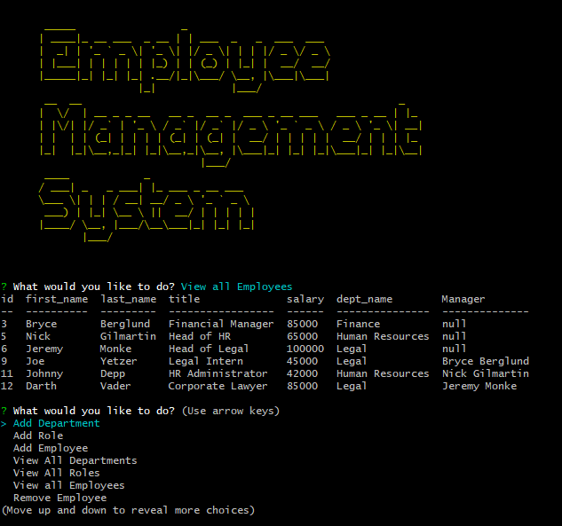

# Employee-Tracker

## Overview
Program that utilizes a mySQL database to view and store data for Employees.

## Table of Contents

1. [Installation](#installation)

2. [Usage](#usage)

3. [Contributions](#contribution)

4. [Test Instructions](#test-instructions)

5. [Screenshots](#screenshots)

6. [Licenses](#licenses)

7. [Questions](#questions)

## Installation

 git clone the repo from here https://github.com/bo-stevenson/employee-tracker, then once it has been cloned run "npm i" in the CLI when located in the file directory to gain the dependencies.

## Usage

Use this program to keep track of your staff. You can see salary, role, and the employees id number. You can enter/remove employees, departments, and roles. You can also update roles for current employees.
Here is an example video: https://drive.google.com/file/d/1TQ0nsTYYRTGI-5vMPLTvo2zvODZ1JiIV/view 

## Contribution

none

## Test Instructions

none

## Screenshots

## License

    
## Questions? Contact Me!

My GitHub is [bo-stevenson](https://www.github.com/bo-stevenson).

My email is [bostevenson1027@gmail.com](mailto:bostevenson1027@gmail.com).
